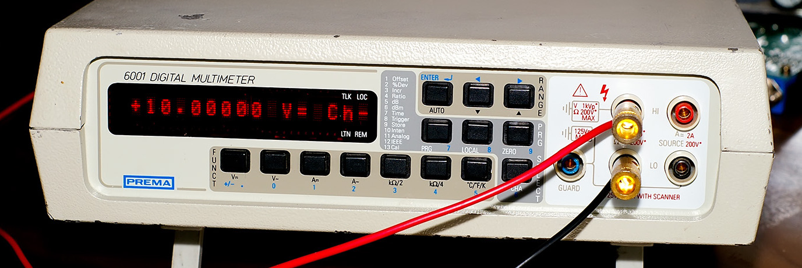
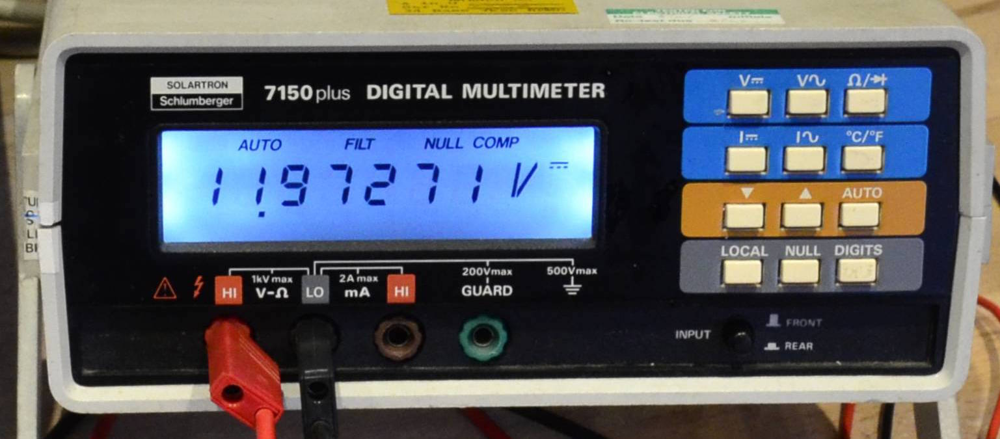
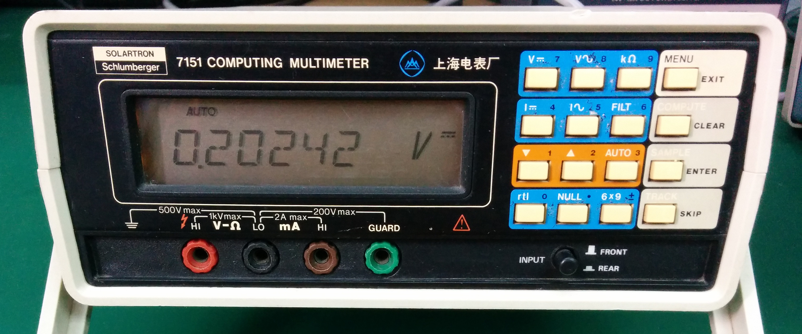

# DMMs

Information about digital multimeters, especially used models of interest to volt-nuts.

## Models with 6.5-digit resolution

### General info:

| Make | Model | Introduced | Comms | Image |
|---|---|---|---|---|
| HP | 3455A | 1976? | GPIB |  |
| HP | 3456A | 1980? | GPIB |  |
| HP | 3457A | 1985? | GPIB |  |
| HP / Agilent / Keysight | 34401A | 1991? | GPIB, RS-232 |  |
| Keithley | 192 | 1982? | ? |  |
| Keithley | 193 | 1985? | GPIB |  |
| Keithley | 196 | 1986? | GPIB |  |
| Keithley | 199 | 1986? | GPIB |  |
| Keithley | 2000 | | GPIB, RS-232 |  |
| Keithley | 2015 | | GPIB, RS-232 |  |
| ~~Keithley~~ | ~~2100~~ | | |  |
| Fluke | 8502A | 1978? | GPIB (opt. 05) |  |
| Fluke | 8505A | | GPIB (opt.) |  |
| Fluke | 8520A | | GPIB |  |
| Fluke | 8845A | | |  |
| Fluke | 8846A | | |  |
| Tektronix | DMM4050 | | |  |
| Datron | 1061A | | GPIB |  |
| Datron | 1062 | | GPIB |  |
| Datron | 1065A | | |  |
| Prema | 6001 | | |  |
| Solartron | 7150 | | GPIB |  |
| Solartron | 7151 | | GPIB |  |
| Rigol | DM3068 | | |  |

Notes:
- "The rebadged Keithley 2100 was quite terrible" [[1](https://www.eevblog.com/forum/chat/bench-multimeter-(another)/msg244830/#msg244830)]
- "Avoid the Keithley 2100, it was an outsourced design with limited support/documentation and some annoying firmware bugs that were never fixed as far as I know." [[1](https://www.eevblog.com/forum/reviews/5-12-and-6-12-digits-bench-multimeters/msg125132/#msg125132)]
- The Tektronix DMM4050 is a re-badge of the Fluke 8846A [[1](http://www.eevblog.com/forum/metrology/the-ltflu-(aka-sza263)-reference-zener-diode-circuit/msg609636/#msg609636)]

### Range info:

| Make | Model | Range scheme | A/D counts | Max value |
|---|---|---|---|---|
| HP | 3455A | 1x, 10x, ... | | 1.499999 |
| HP | 3456A | 1x, 10x, ... | | 1.199999 |
| HP | 3457A | 3x, 30x, ... | | 3.030000 |
| HP/Agilent | 34401A | 1x, 10x, ... | 1,200,000 | |
| Keithley | 192 | 2x, 20x, ... | 2,000,000 | 1.999999 |
| Keithley | 193 | 2x, 20x, ... | 2,200,000 | 2.199999 |
| Keithley | 196 | 3x, 30x, ... | 3,030,000 | |
| Keithley | 2000 | 1x, 10x, ... | | "120% overrange" |
| Keithley | 2015 | 1x, 10x, ... | | "120% overrange" |
| Fluke | 8502A | (gain:) x64, x8, x1, x/8, x/64 | | 312.5mV, 2.5V, 20V, 160V, 1200V |
| Fluke | 8505A | | | |
| Fluke | 8520A | | | |
| Datron | 1061A | | 1,999,999 | |
| Datron | 1062 | | 1,999,999 | |
| Datron | 1065A | | 1,999,999 | |
| Prema | 6001 | | | |
| Solartron | 7150 | | 2,350,000 | |

### DC Volts info:

| Make | Model | Best res. (range) | Hi-Z (value) |
|---|---|---|---|
| HP | 3456A | 1uV (1V) | 100mV, 1V, 10V |
| HP | 3456A | 100nV (100mV) | 100mV, 1V, 10V |
| HP | 3457A | 10nV (30mV) | 30mV, 300mV, 3V |
| HP/Agilent | 34401A | 100nV (100mV) | 100mV, 1V, 10V (>10G) |
| Keithley | 192 | 1uV (2V*) | 200mV, 2V, 20V (>1G) |
| Keithley | 193 | 100nV (200mV) | 200mV, 2V |
| Keithley | 196 | 100nV (300mV) | 300mV, 3V (>1G) |
| Keithley | 2000 | 100nV (100mV) | 100mV, 1V, 10V (>10G) |
| Keithley | 2015 | | |
| Fluke | 8502A | 1uV (1V) | 100mV, 1V, 10V |
| Fluke | 8505A | | |
| Fluke | 8520A | | |
| Datron | 1062 | | |
| Prema | 6001 | | |
| Solartron | 7150 |  | 200mV, 2V (>10G) |

Note:
- Keithley 192 has no 0.2V range in 6.5-digit mode (best 6.5-digit resolution is 1uV in 2V range).

### Calibration info:

| Make | Model | Cal methods |
|---|---|---|
| HP | 3455A | Trimpots |
| HP | 3456A | Trimpots |
| HP | 3457A | Front panel, GPIB |
| HP/Agilent | 34401A | Front panel, GPIB |
| Keithley | 192 | Trimpots |
| Keithley | 193 | Front panel, GPIB |
| Keithley | 196 | Front panel, GPIB |
| Keithley | 2000 | Front panel, GPIB |
| Keithley | 2015 | Front panel, GPIB |
| Fluke | 8502A | Front panel (calibration memory, option -04) or trimpots |
| Fluke | 8505A | |
| Fluke | 8520A | |
| Datron | 1062 | |
| Prema | 6001 | |

Notes:
- The 34401A's calibration counts each range as a "calibration", so a full calibration will increase the count by 35.

Ohms calibration info:

| Make | Model | Standards needed | Valid cal. input range |
|---|---|---|---|
| HP | 3455A | 1k, 10k, 100k, 1M, 10M | (arbitrary) |
| HP | 3456A | 1k, 10k, 100k, 1M, 10M | (arbitrary) |
| HP | 3457A | 30R, 300R, 3k, 30K, 300K, 3Meg, 30Meg | (See note*) |
| HP/Agilent | 34401A | 100R, 1k, 10k, 100k, 1M, 10M, 100M | 0.9x to 1.1x |
| Keithley | 192 | 190R, 1.9k, 19k, 190k, 1.9M, 10M | (must less than full-scale, e.g. 1.999999) |
| Keithley | 193 | 200R, 2k, 20k, 200k, 2M, 20M, 200M | (allows entering arbitrary values) |
| Keithley | 196 | 300R, 3k, 30k, 300k, 3M, 30M, 300M | (allows entering arbitrary values) |
| Keithley | 2000 | 1k, 10k, 100k, 1M | 0.9x to 1.1x |
| Keithley | 2015 | 1k, 10k, 100k, 1M | 0.9x to 1.1x |
| Fluke | 8502A | 1.9k, 250K, 4M, 100M | (arbitrary) |
| Fluke | 8505A | | |
| Fluke | 8520A | | |
| Datron | 1062 | | |
| Prema | 6001 | | |

Notes:
- The 3457A allows entering the exact value of the calibration source, but I'm not sure of the allowed range of values.
- The Keithley 192 calls for 1.9x calibration values.  The manual also specifies "To prevent AD saturation, peak AC+DC value must be less than full scale on any range".
- Fluke 8502A uses 2k, 256k, and 4.091M reference resistors internally.

### Additional resources:

- HP 3455A
  - daqq.eu [[1](http://www.daqq.eu/?p=577)] [[2](http://www.daqq.eu/?p=645)] [[3](http://www.daqq.eu/?p=695)]
- HP 3456A
  - [xDevs](https://xdevs.com/fix/hp3456a/)
- Keithley 199
  - [Re-engineered digital board](https://www.eevblog.com/forum/repair/keithley-199-digital-board-replacement/)
  - [Replacing 1N4579 ref. zener with LM399](https://www.eevblog.com/forum/chat/bench-multimeter-(another)/msg265846/#msg265846)

## Models with 5.5-digit resolution

### General info:

| Make | Model | Introduced | Comms | Image |
|---|---|---|---|---|
| HP | 3478A | | | |
| Keithley | 195A | 1984? | GPIB |  |
| Keithley | 199* | 1988? | GPIB |  |
| Fluke | 45 | | |  |
| Fluke | 8800A | | |  |
| Fluke | 8808A | | |  |
| Fluke | 8810A | | |  |
| Fluke | 8840A | | |  |
| Fluke | 8842A | | |  |
| Datron | 1061 | | |  |
| Datron | 1065 | | |  |
| Rigol | DM3058E | | |  |

Notes:
- The Keithley 199 is a scanner.

### Range info:

| Make | Model | Range scheme | A/D counts | Max value |
|---|---|---|---|---|
| Datron | 1061 | 2x, 20x, ... | 199,999 | |
| Datron | 1065 | 2x, 20x, ... | 199,999 | |

## Models with 7.5-digit resolution

### General info:

| Make | Model | Introduced | Comms | Image |
|---|---|---|---|---|
| Datron | 1071 | | |  |
| Datron | 1072 | | |  |
| Datron | 1081 | | |  |
| Datron | 1082 | | |  |

### Range info:

| Make | Model | Range scheme | A/D counts | Max value |
|---|---|---|---|---|
| Datron | 1071 | 2x, 20x, ... | 19,999,999 | |
| Datron | 1072 | 2x, 20x, ... | 19,999,999 | |
| Datron | 1081 | 2x, 20x, ... | 19,999,999 | |
| Datron | 1082 | 2x, 20x, ... | 19,999,999 | |

## Models with 8.5-digit resolution

### General info:

| Make | Model | Introduced | Comms | Image |
|---|---|---|---|---|
| HP/Agilent/Keysight | 3458a | | |  |
| Datron | 1271 | | |  |
| Datron | 1281 | | |  |

