# DMMs

Information about digital multimeters, especially used models of interest to volt-nuts.

## Models with 6.5-digit resolution

### General info:

| Make | Model | Introduced | Comms | Image |
|---|---|---|---|---|
| HP | 3455A | 1976? | GPIB | 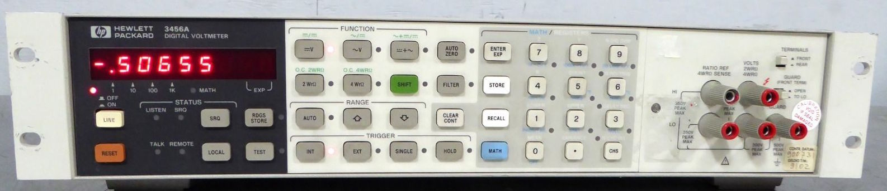 |
| HP | 3456A | 1980? | GPIB | 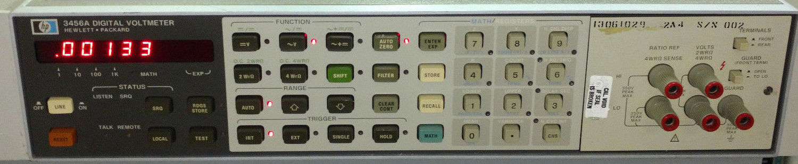 |
| HP | 3457A | 1985? | GPIB | 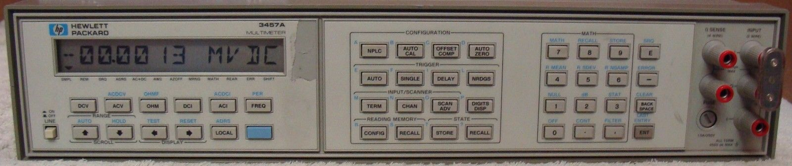 |
| HP / Agilent / Keysight | 34401A | 1991? | GPIB, RS-232 | 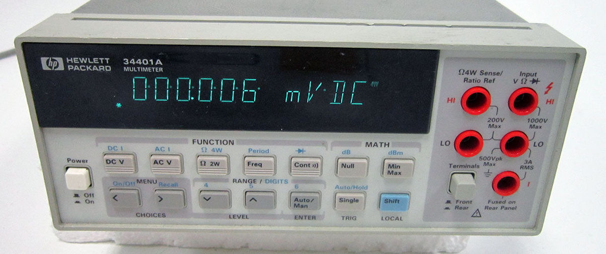 |
| Keithley | 192 | 1982? | ? | 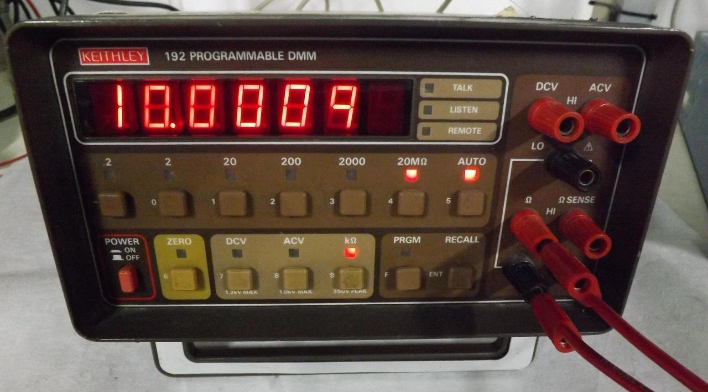 |
| Keithley | 193 | 1985? | GPIB | 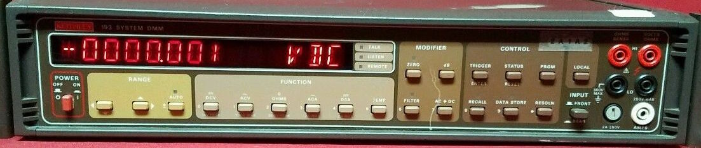 |
| Keithley | 196 | 1986? | GPIB | 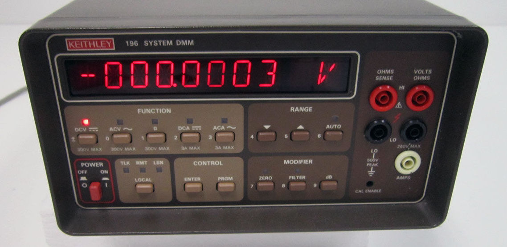 |
| Keithley | 2000 | | GPIB, RS-232 |  |
| Keithley | 2015 | | GPIB, RS-232 | 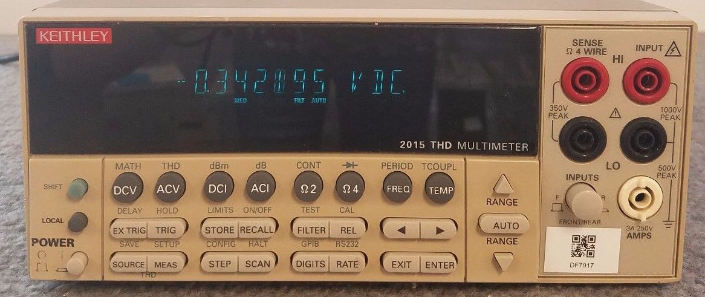 |
| ~~Keithley~~ | ~~2100~~ | | | 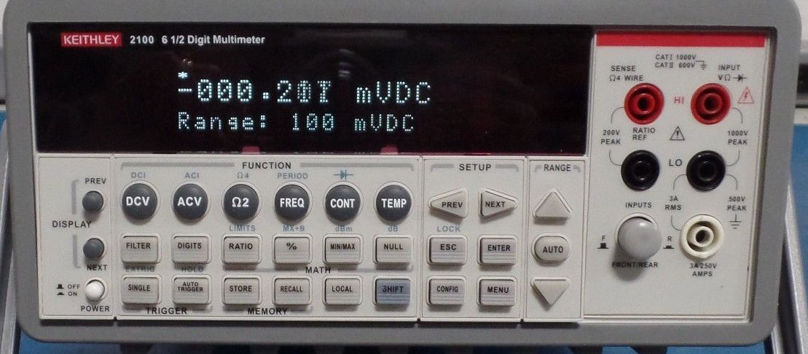 |
| Fluke | 8502A | 1978? | GPIB (opt. 05) |  |
| Fluke | 8505A | 1983? | GPIB (opt. 05) | 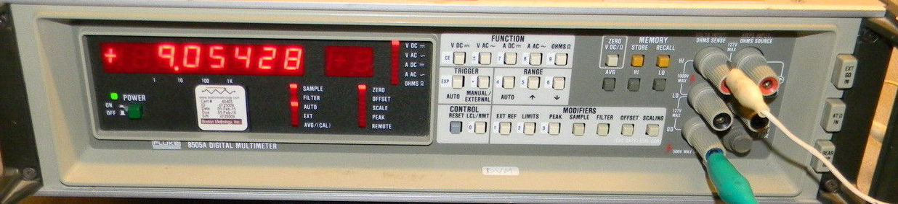 |
| Fluke | 8506A | 1983? | GPIB (opt. 05) | 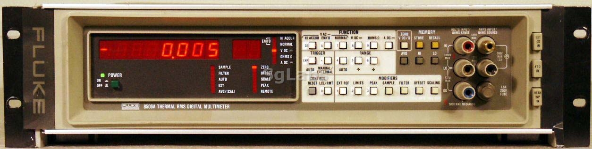 |
| Fluke | 8845A | 2006? | GPIB, RS-232, Ethernet | 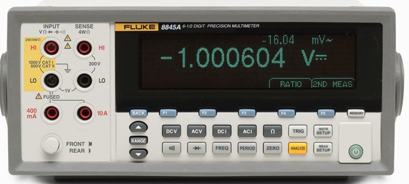 |
| Fluke | 8846A | 2006? | GPIB, RS-232, Ethernet | 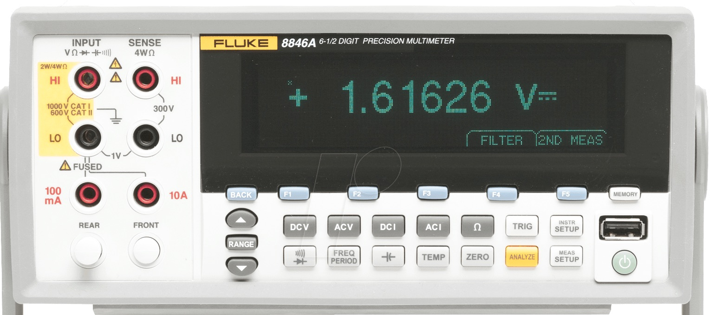 |
| Tektronix | DMM4050 | | | 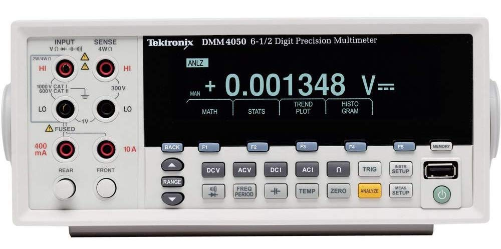 |
| Datron | 1061A | | GPIB | 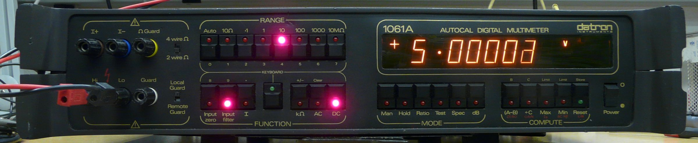 |
| Datron | 1062 | | GPIB | 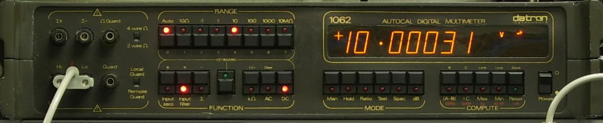 |
| Datron | 1065A | | | 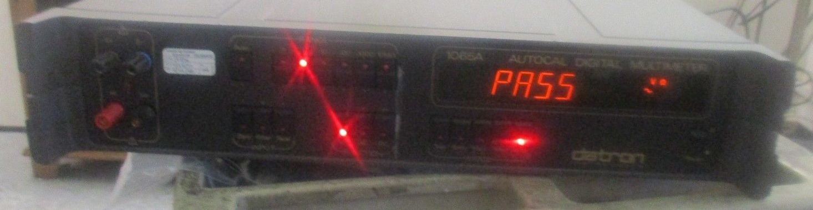 |
| Rigol | DM3068 | | |  |

Notes:
- "The rebadged Keithley 2100 was quite terrible" [[1](https://www.eevblog.com/forum/chat/bench-multimeter-(another)/msg244830/#msg244830)]
- "Avoid the Keithley 2100, it was an outsourced design with limited support/documentation and some annoying firmware bugs that were never fixed as far as I know." [[1](https://www.eevblog.com/forum/reviews/5-12-and-6-12-digits-bench-multimeters/msg125132/#msg125132)]
- The Tektronix DMM4050 is a re-badge of the Fluke 8846A [[1](http://www.eevblog.com/forum/metrology/the-ltflu-(aka-sza263)-reference-zener-diode-circuit/msg609636/#msg609636)]

### Range info:

| Make | Model | Range scheme | A/D counts | Max value |
|---|---|---|---|---|
| HP | 3455A | 1x, 10x, ... | | 1.499999 |
| HP | 3456A | 1x, 10x, ... | | 1.199999 |
| HP | 3457A | 3x, 30x, ... | | 3.030000 |
| HP/Agilent | 34401A | 1x, 10x, ... | 1,200,000 | |
| Keithley | 192 | 2x, 20x, ... | 2,000,000 | 1.999999 |
| Keithley | 193 | 2x, 20x, ... | 2,200,000 | 2.199999 |
| Keithley | 196 | 3x, 30x, ... | 3,030,000 | |
| Keithley | 2000 | 1x, 10x, ... | | "120% overrange" |
| Keithley | 2015 | 1x, 10x, ... | | "120% overrange" |
| Fluke | 8502A | (gain:) x64, x8, x1, x/8, x/64 | | 312.5mV, 2.5V, 20V, 160V, 1200V |
| Fluke | 8505A | 2x, 20x, ... | | 2.000000 |
| Fluke | 8506A | 2x, 20x, ... | | 2.000000 |
| Fluke | 8845A | 1x, 10x, ... | | "20% overrange" |
| Fluke | 8846A | 1x, 10x, ... | | "20% overrange" |
| Datron | 1061A | | 1,999,999 | |
| Datron | 1062 | | 1,999,999 | |
| Datron | 1065A | | 1,999,999 | |

Notes:
- HP 3457A supports greater resolution via GPIB
- HP 34401A supports greater resolution via GPIB / RS-232
- Fluke 8505A and 8506A support 7.5-digits in the 10V range (1uV resolution) using AVG operating mode

### DC Volts info:

| Make | Model | Ref. | Best res. (range) | Hi-Z (value) |
|---|---|---|---|---|
| HP | 3456A | | 1uV (1V) | 100mV, 1V, 10V |
| HP | 3456A | | 100nV (100mV) | 100mV, 1V, 10V |
| HP | 3457A | LM399 | 10nV (30mV) | 30mV, 300mV, 3V |
| HP/Agilent | 34401A | LM399 | 100nV (100mV) | 100mV, 1V, 10V (>10G) |
| Keithley | 192 | | 1uV (2V*) | 200mV, 2V, 20V (>1G) |
| Keithley | 193 | | 100nV (200mV) | 200mV, 2V |
| Keithley | 196 | | 100nV (300mV) | 300mV, 3V (>1G) |
| Keithley | 2000 | | 100nV (100mV) | 100mV, 1V, 10V (>10G) |
| Keithley | 2015 | | | |
| Fluke | 8502A | | 1uV (1V) | 100mV, 1V, 10V |
| Fluke | 8505A | | 100nV (200mV) | 200mV, 2V, 20V |
| Fluke | 8506A | SZA263 [[1](https://doc.xdevs.com/doc/Fluke/8506A/r2adc/174747jo1f3fy75zc4j9vy.jpg)] | 100nV (200mV) | 200mV, 2V, 20V |
| Fluke | 8845A | LM399? | 100nV (100mV) | 100mV, 1V, 10V (>10G) |
| Fluke | 8846A | LM399 [[1](https://youtu.be/5dJyJD30NXQ?t=4m23s)] | 100nV (100mV) | 100mV, 1V, 10V (>10G) |
| Datron | 1061A | | | | |
| Datron | 1062 | | | | |
| Datron | 1065A | | | | |

Note:
- Keithley 192 has no 0.2V range in 6.5-digit mode (best 6.5-digit resolution is 1uV in 2V range).

### Calibration info:

| Make | Model | Cal methods |
|---|---|---|
| HP | 3455A | Trimpots |
| HP | 3456A | Trimpots |
| HP | 3457A | Front panel, Remote |
| HP/Agilent | 34401A | Front panel, Remote |
| Keithley | 192 | Trimpots |
| Keithley | 193 | Front panel, Remote |
| Keithley | 196 | Front panel, Remote |
| Keithley | 2000 | Front panel, Remote |
| Keithley | 2015 | Front panel, Remote |
| Fluke | 8502A | Front panel (calibration memory, option -04) or trimpots |
| Fluke | 8505A | Front panel |
| Fluke | 8506A | |
| Fluke | 8845A | Remote only |
| Fluke | 8846A | Remote only |
| Datron | 1061A | Front panel, Remote |
| Datron | 1062 | Front panel, Remote |
| Datron | 1065A | |

Notes:
- The 34401A's calibration counts each range as a "calibration", so a full calibration will increase the count by 35.

#### Ohms calibration info:

| Make | Model | Standards needed | Valid cal. input range |
|---|---|---|---|
| HP | 3455A | 1k, 10k, 100k, 1M, 10M | (arbitrary) |
| HP | 3456A | 1k, 10k, 100k, 1M, 10M | (arbitrary) |
| HP | 3457A | 30R, 300R, 3k, 30K, 300K, 3Meg, 30Meg | (See note*) |
| HP/Agilent | 34401A | 100R, 1k, 10k, 100k, 1M, 10M, 100M | 0.9x to 1.1x |
| Keithley | 192 | 190R, 1.9k, 19k, 190k, 1.9M, 10M | (must less than full-scale, e.g. 1.999999) |
| Keithley | 193 | 200R, 2k, 20k, 200k, 2M, 20M, 200M | (allows entering arbitrary values) |
| Keithley | 196 | 300R, 3k, 30k, 300k, 3M, 30M, 300M | (allows entering arbitrary values) |
| Keithley | 2000 | 1k, 10k, 100k, 1M | 0.9x to 1.1x |
| Keithley | 2015 | 1k, 10k, 100k, 1M | 0.9x to 1.1x |
| Fluke | 8502A | 1.9k, 250K, 4M, 100M | (arbitrary) |
| Fluke | 8505A | 1.9k, 250k, 4M, 19M, 100M | "any known value from 60% of range to full scale" |
| Fluke | 8506A | 1.9k, 4M, 250k, 100M | |
| Fluke | 8845A | 100R, 1k, 10k, 100k, 1M, 10M, 100M | |
| Fluke | 8846A | 10R, 100R, 1k, 10k, 100k, 1M, 10M, 100M, 1G | |
| Datron | 1061A | 10R, 100R, 1k, 10k, 100k, 1M, 10M | "20% to 200% of range" |
| Datron | 1062 | 10R, 100R, 1k, 10k, 100k, 1M, 10M | "20% to 200% of range" |
| Datron | 1065A | | |

Notes:
- The 3457A allows entering the exact value of the calibration source, but I'm not sure of the allowed range of values.
- The Keithley 192 calls for 1.9x calibration values.  The manual also specifies "To prevent AD saturation, peak AC+DC value must be less than full scale on any range".
- Fluke 8502A, 8505A and 8506A use a set of 2k, 256k, and 4.091M reference resistors internally.

### Additional resources:

- HP 3455A
  - daqq.eu [[1](http://www.daqq.eu/?p=577)] [[2](http://www.daqq.eu/?p=645)] [[3](http://www.daqq.eu/?p=695)]
  - [emperor](http://emperoroftestequipment.weebly.com/)
- HP 3456A
  - [xDevs](https://xdevs.com/fix/hp3456a/)
  - [emperor](http://emperoroftestequipment.weebly.com/)
- HP 3457A
  - [emperor](http://emperoroftestequipment.weebly.com/)
- Keithley 2015
  - [emperor](http://emperoroftestequipment.weebly.com/)
- Fluke 8502A
  - [emperor](http://emperoroftestequipment.weebly.com/)
- Fluke 8506A
  - [emperor](http://emperoroftestequipment.weebly.com/)
- Datron 1062
  - [emperor](http://emperoroftestequipment.weebly.com/)

## Models with 5.5-digit resolution

### General info:

| Make | Model | Introduced | Comms | Image |
|---|---|---|---|---|
| HP | 3468B | | | |
| HP | 3478A | | | |
| Keithley | 195 | 1982? | | 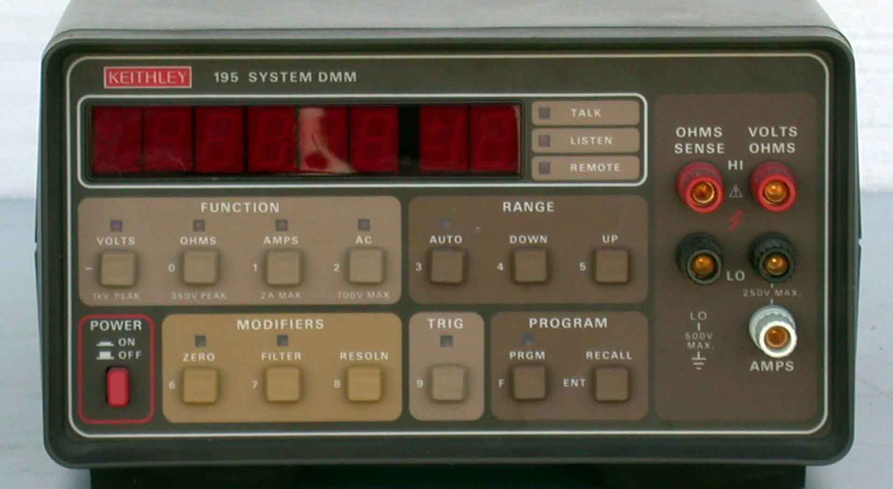 |
| Keithley | 195A | 1984? | GPIB | 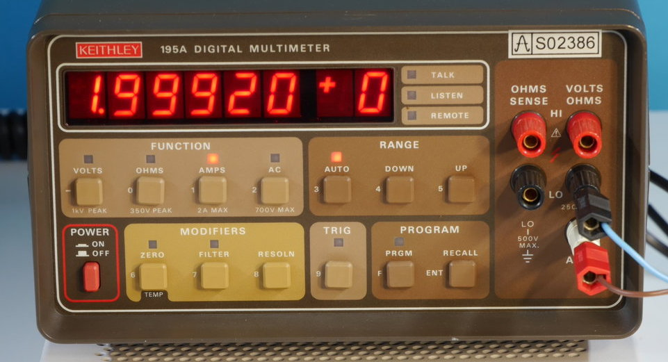 |
| Keithley | 199* | 1988? | GPIB | 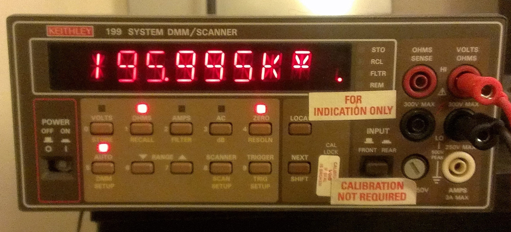 |
| Fluke | 8800A | 1974? | TTL output (opt. 02) | 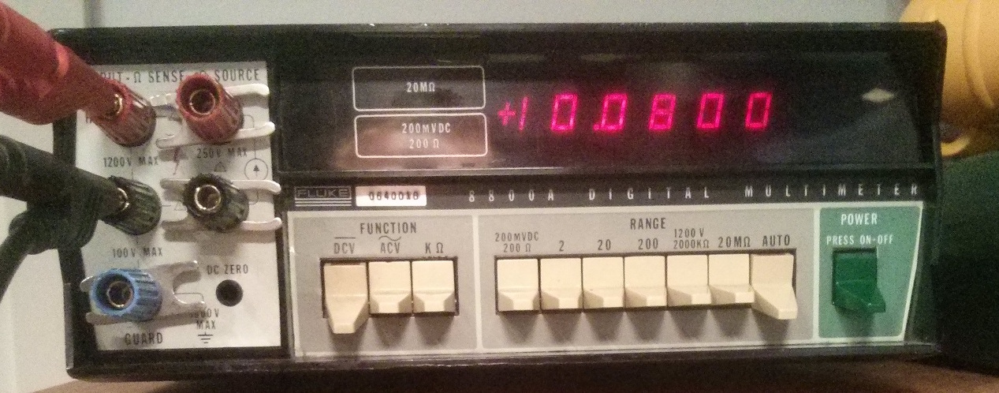 |
| Fluke | 8810A | 1978? | TTL output (opt. 002) | 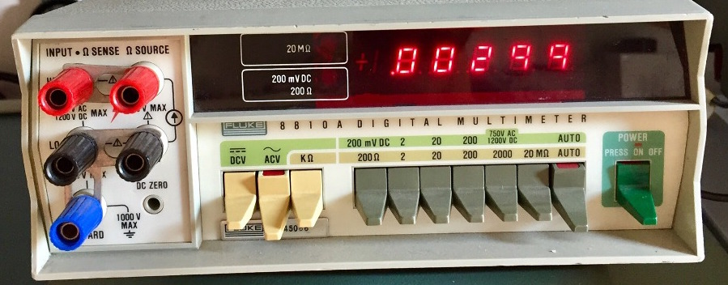 |
| Fluke | 8520A | 1979? | GPIB | 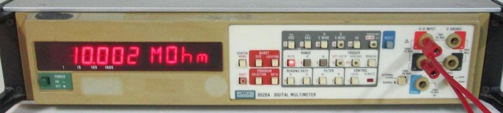 |
| Fluke | 45 | 1989? | GPIB (opt. O5K), RS-232 | 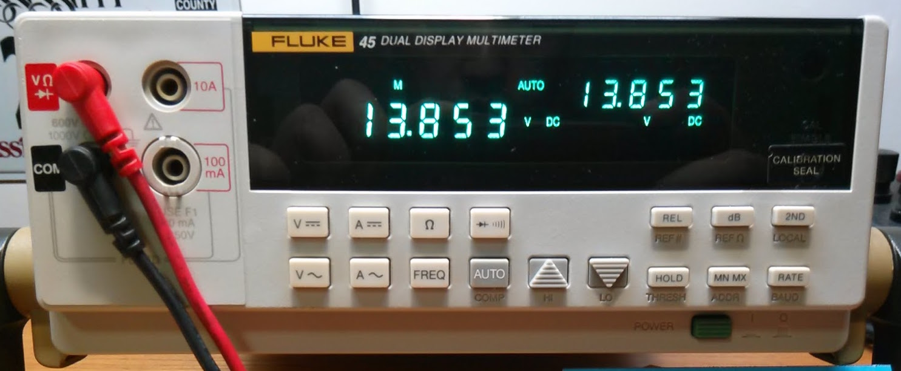 |
| Fluke | 8840A | | | 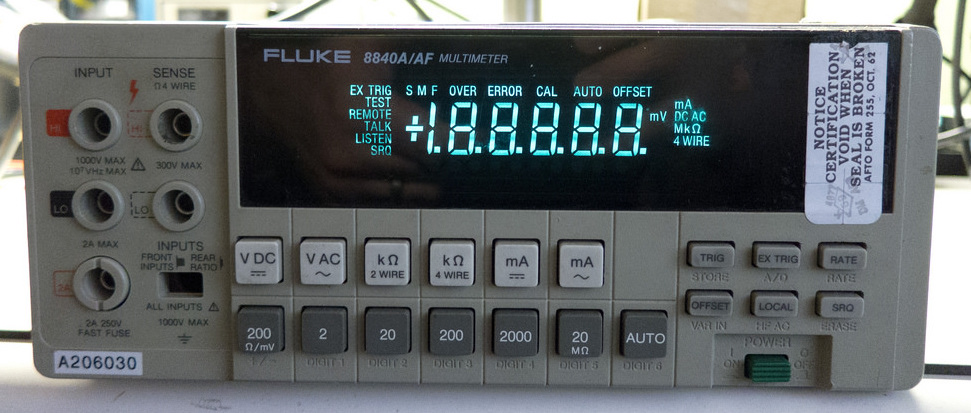 |
| Fluke | 8842A | | | 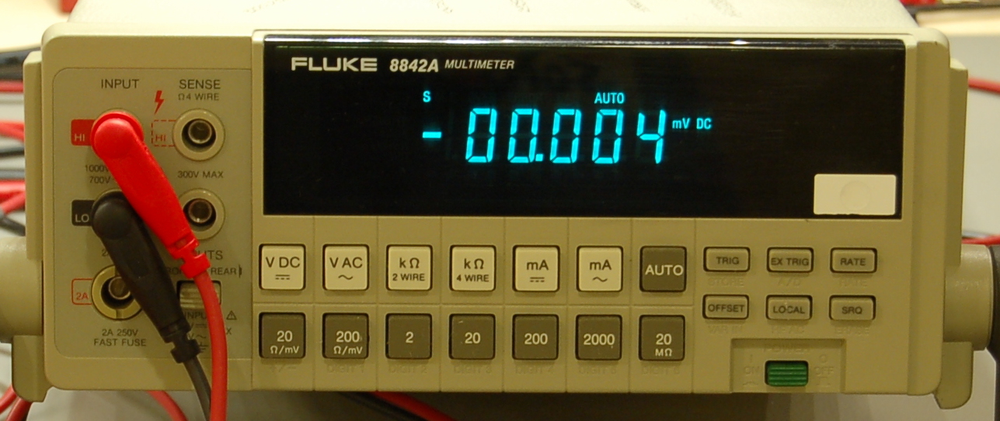 |
| Fluke | 8808A | | | 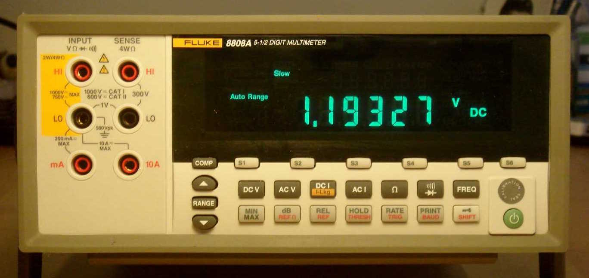 |
| Datron | 1061 | | | 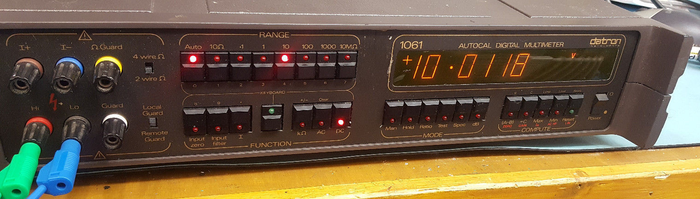 |
| Datron | 1065 | | | 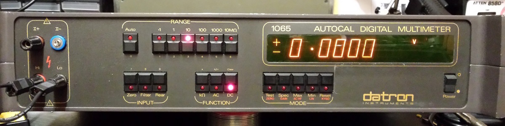 |
| Rigol | DM3058E | | | 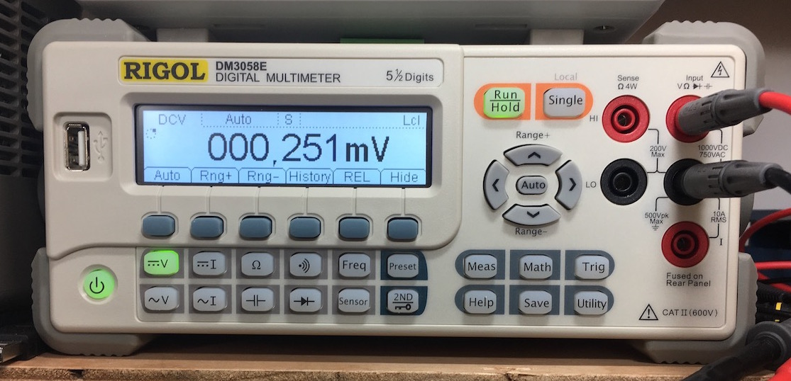 |

Notes:
- It appears the Keithley 195A is a 195 with the addition of temperature measurement.
- The Keithley 199 is a scanner.
- The Fluke 45 can only do 99,999 counts (5 digits), so it isn't a "true" 5.5-digit meter.

### Range info:

| Make | Model | Range scheme | A/D counts | Max value |
|---|---|---|---|---|
| Keithley | 195 | 2x, 20x, ... | | 1.99999 |
| Keithley | 195A | 2x, 20x, ... | | 1.99999 |
| Keithley | 199 | 3x, 30x, ... | 302,999 | |
| Fluke | 8800A | 2x, 20x, ... | | 1.99999 |
| Fluke | 8810A | 2x, 20x, ... | | 1.99999 |
| Fluke | 8520A | 1x, 10x, ... | | 1.99999 |
| Fluke | 45 | 3x, 30x, ... / 1x, 10x, ... | | 3.0000 / 9.9999 |
| Fluke | 8840A |  | | |
| Fluke | 8842A |  | | |
| Datron | 1061 | 2x, 20x, ... | 199,999 | |
| Datron | 1065 | 2x, 20x, ... | 199,999 | |

Notes:
- Fluke 45
  - The Fluke 45 uses a 3x range scheme in 4.5-digit mode, and a 1x range scheme in 5-digit mode.
- Fluke 8520A
  - DCV full-scale readings: 199.999mV, 1.99999V, 16.0100V, 130.100V, 1024.00V

### DC Volts info:

| Make | Model | Ref. | Best res. (range) | Hi-Z (value) |
|---|---|---|---|---|
| Keithley | 195 |  | 100nV (20mV) | 20mV, 200mV, 2V (>1G) |
| Keithley | 195A |  | 100nV (20mV) | 20mV, 200mV, 2V (>1G) |
| Keithley | 199 | 1N4579 [[1](https://www.ifixit.com/Teardown/Keithley+199+Scanner+Multimeter+Teardown/18814)] | 1uV (300mV) | 300mV, 3V (>1G) |
| Fluke | 8800A | SZA263? | 1uV (200mV) | 200mV, 2V (>1G) |
| Fluke | 8810A |  | 1uV (200mV) | 200mV, 2V (>1G) |
| Fluke | 8520A | SZA263 [[1](https://www.eevblog.com/forum/reviews/fluke-8520a/msg81302/#msg81302)] | 1uV (100mV) | 100mV, 1V, 10V |
| Fluke | 45 |  | 1uV (100mV) | n/a (10M on all ranges) |
| Fluke | 8840A | LTFLU-1 [[1](https://youtu.be/X4_iRB2DIW8?t=12m36s)] | | |
| Fluke | 8842A | LTFLU-1 [[1](https://www.eevblog.com/forum/metrology/the-ltflu-(aka-sza263)-reference-zener-diode-circuit/msg610468/#msg610468)] | | |

### Calibration info:

| Make | Model | Cal methods |
|---|---|---|
| Keithley | 195 | Front panel, Remote |
| Keithley | 195A | Front panel, Remote |
| Keithley | 199 | Front panel, Remote |
| Fluke | 8800A | Trimpots |
| Fluke | 8810A | Trimpots |
| Fluke | 8520A | Trimpots |
| Fluke | Fluke 45 | Front panel, Remote |
| Fluke | 8840A |  |
| Fluke | 8842A |  |

Notes:
- Fluke 45
  - Specific values cannot be entered for the three calibration points (0V, 90mV, -90mV).  I.e., you must supply _exactly_ 90.000mV.

#### Ohms calibration info:

| Make | Model | Standards needed | Valid cal. input range |
|---|---|---|---|
| Keithley | 195 | 19R, 190R, 1.9k, 19k, 190k, 1.9M, 10M | |
| Keithley | 195A | 19R, 190R, 1.9k, 19k, 190k, 1.9M, 10M | |
| Keithley | 199 | 190R, 1.9k, 19k, 190k, 1.9M, 19M, 100M | |
| Fluke | 8800A | 100R, 1k, 10k, 100k, 1M, 10M | (arbitrary) |
| Fluke | 8810A | 100R, 1k, 10k, 100k, 1M, 10M | (arbitrary) |
| Fluke | 8520A | 100R, 1k, 10k, 100k, 1M | (arbitrary) |
| Fluke | 45 | 290R, 2.9k, 29k, 290k, 2.9M | (See table 4-9 in service manual) |
| Fluke | 8840A | | |
| Fluke | 8842A | | |

Notes:
- Fluke 45
  - The service manual also describes using 1.9x Ohm values as alternate calibration points, but calibrating further away from a full-scale value introduces additional error.
  - Table 4-9 in the service manual lists the valid ranges for all calibration constants.  For Ohms, these are:
    - Ohms range 1: 0.9990 to 1.0090
    - Ohms range 2: 1.0000 to 1.0100
    - Ohms range 3: 1.0040 to 1.0140
    - Ohms range 4: 0.9990 to 1.0090
    - Ohms range 5: 0.9990 to 1.0090
    - Ohms range 6: 0.9990 to 1.0090

### Additional resources:

- HP 3468B
  - [emperor](http://emperoroftestequipment.weebly.com/)
- Fluke 8800A
  - [emperor](http://emperoroftestequipment.weebly.com/)
- Fluke 8520A
  - teardown [[1](https://www.youtube.com/watch?v=ULQroWJUZdw)] [[2](https://www.eevblog.com/forum/repair/51-fluke-8520a-how-far-does-this-rabbit-hole-go-part-1/)]
  - [teardown](https://www.eevblog.com/forum/reviews/fluke-8520a/)
  - [emperor](http://emperoroftestequipment.weebly.com/)
- Fluke 8840A
  - [emperor](http://emperoroftestequipment.weebly.com/)
- Keithley 199
  - [emperor](http://emperoroftestequipment.weebly.com/)
  - [Re-engineered digital board](https://www.eevblog.com/forum/repair/keithley-199-digital-board-replacement/)
  - [Replacing 1N4579 ref. zener with LM399](https://www.eevblog.com/forum/chat/bench-multimeter-(another)/msg265846/#msg265846)

## Models with 7.5-digit resolution

### General info:

| Make | Model | Introduced | Comms | Image |
|---|---|---|---|---|
| Keithley | 2001 | | | 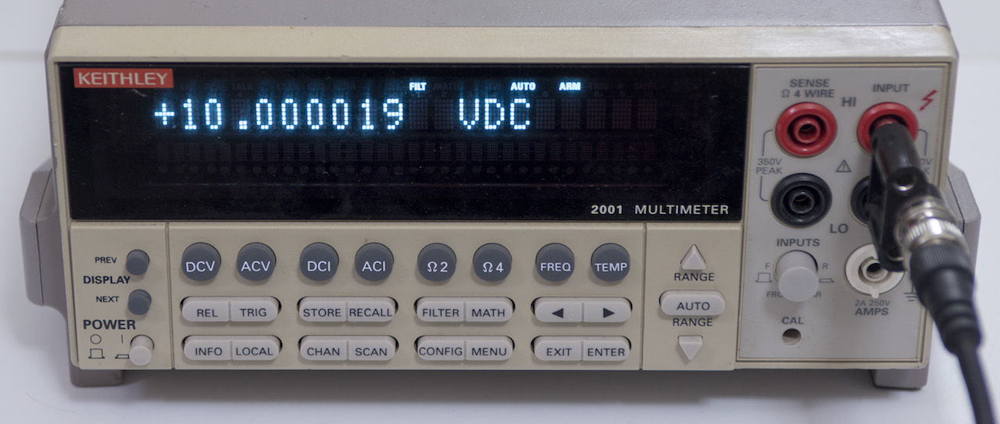 |
| Keithley | 2010 | | | 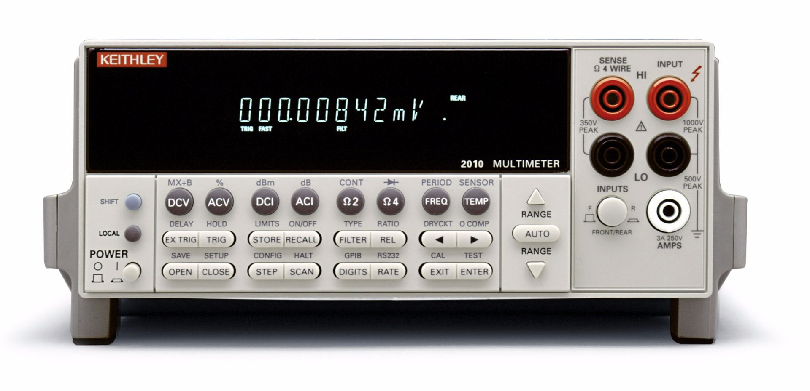 |
| Datron | 1071 | | | 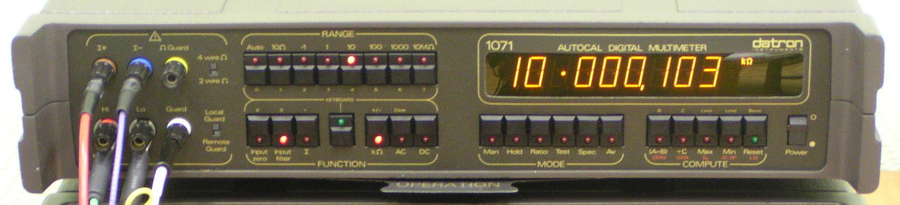 |
| Datron | 1072 | | |  |
| Datron | 1081 | | | 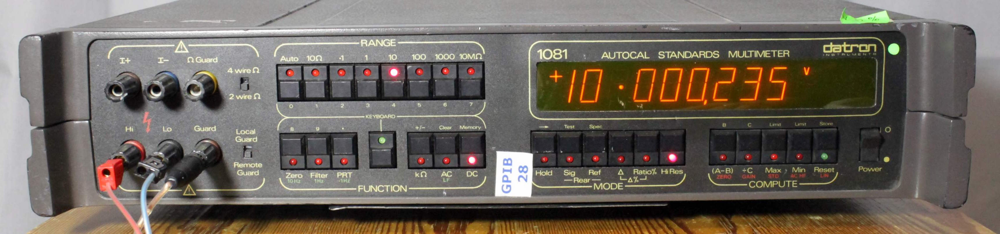 |
| Datron | 1082 | | | 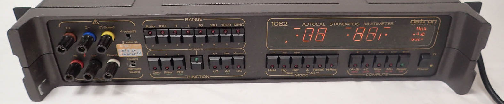 |

### Range info:

| Make | Model | Range scheme | A/D counts | Max value |
|---|---|---|---|---|
| Datron | 1071 | 2x, 20x, ... | 19,999,999 | |
| Datron | 1072 | 2x, 20x, ... | 19,999,999 | |
| Datron | 1081 | 2x, 20x, ... | 19,999,999 | |
| Datron | 1082 | 2x, 20x, ... | 19,999,999 | |

## Models with 8.5-digit resolution

### General info:

| Make | Model | Introduced | Comms | Image |
|---|---|---|---|---|
| HP/Agilent/Keysight | 3458a | | | 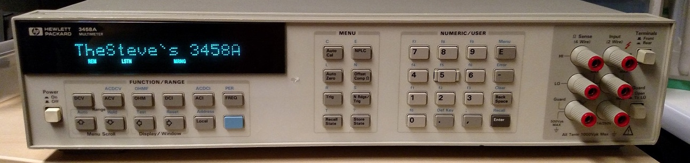 |
| Keithley | 2002 | | | 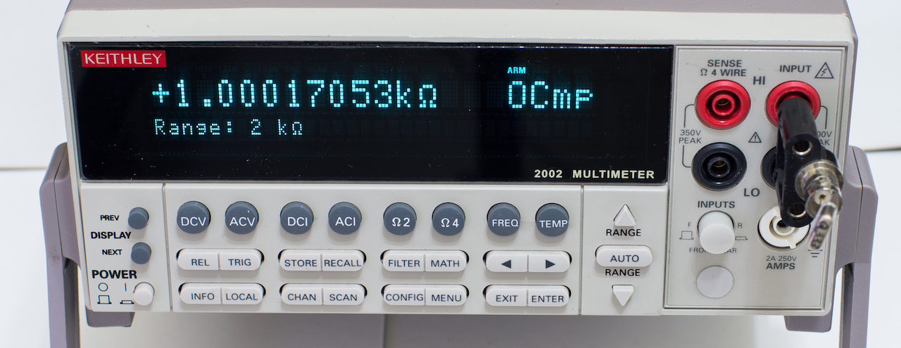 |
| Datron | 1271 | | | 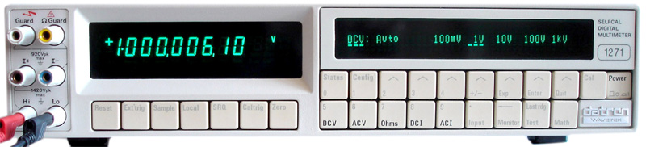 |
| Datron | 1281 | | | 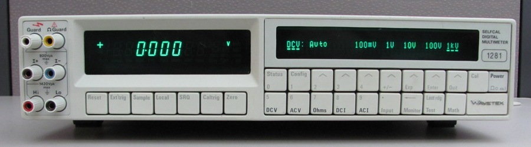 |

## Obscure models

See [obscure.md](obscure.md).

## Special thanks

- TiN at [xDevs.com](https://xdevs.com/fix/) for his extremely thorough repair and teardown articles, high resolution photos and manuals collection.

